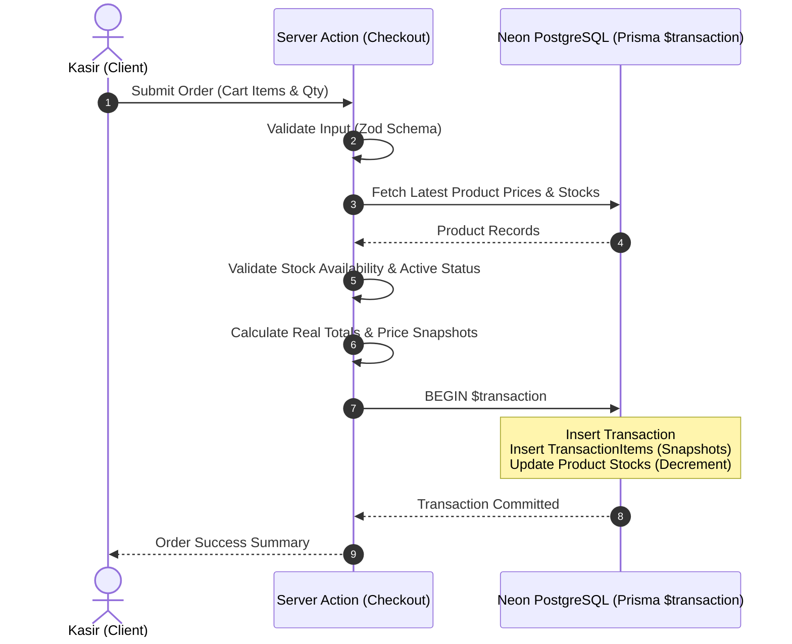

# Architecture & Technical Blueprint - Mini Point of Sale (POS)

## 1. System Architecture Overview

Aplikasi Mini POS dibangun menggunakan arsitektur modern berbasis **Next.js 16 (App Router)** dengan pola **Server Actions** dan **Prisma ORM** yang terhubung ke database **Neon PostgreSQL**.

```
[ Client Browser (React 19 Components) ]
          │
          ▼  (Server Actions / React Server Components)
[ Next.js 16 Server Layer ]
          │
          ├── Zod Validation Schema
          ├── Business Logic & Price Snapshotting
          │
          ▼  (Prisma ORM - Atomic Transaction $transaction)
[ Neon PostgreSQL Database ]
```

---

## 2. Directory Structure Blueprint

```
c:/coba/mini-pos/
├── app/
│   ├── actions/
│   │   ├── productActions.ts      # Server Actions untuk CRUD & Toggle Status Produk
│   │   ├── transactionActions.ts  # Server Actions untuk Checkout & Prisma $transaction
│   │   └── exportActions.ts       # Server Actions / Utilities untuk Ekspor CSV
│   ├── globals.css                # Global CSS & Tailwind Design Tokens (Warna & Fonts)
│   ├── layout.tsx                 # Root Layout dengan Font Inter & JetBrains Mono
│   └── page.tsx                   # Main POS Dashboard View
├── components/
│   ├── ui/                        # Reusable UI Components (Button, Input, Modal, Badge)
│   ├── pos/
│   │   ├── ProductCatalog.tsx     # Grid Katalog Produk, Search, & Filter Status
│   │   ├── CartPanel.tsx          # Panel Keranjang Belanja, Realtime Subtotal & Total
│   │   └── CheckoutModal.tsx      # Modal Ringkasan Transaksi & Struk
│   ├── products/
│   │   └── ProductManagementModal.tsx # Modal Pengelolaan Produk (Tabel & Form Input)
│   └── history/
│       └── TransactionHistoryModal.tsx # Modal Riwayat Transaksi & Filter Tanggal
├── lib/
│   ├── prisma.ts                  # Prisma Client Singleton Instance
│   ├── validations.ts             # Zod Schema Validation Rules
│   └── utils.ts                   # Helper untuk Formatting Currency (IDR), Date, & Classnames
├── prisma/
│   ├── schema.prisma              # Database Models (Product, Transaction, TransactionItem)
│   └── seed.ts                    # Script Seeding Data Produk Awal
├── tests/
│   ├── product.test.ts            # Unit Test: Validasi Status & Stock Produk
│   ├── stock.test.ts              # Integration Test: Integritas Stok & Race Condition Check
│   └── transaction.test.ts        # Unit Test: Snapshot Harga & Total Calculation
├── vitest.config.ts               # Konfigurasi Runner Vitest
├── PRD.md                         # Product Requirement Document
├── DESIGN.md                      # UI/UX Design System Tokens
├── ARCHITECTURE.md                # Dokumen Arsitektur Ini
├── TEST_PLAN.md                   # Rencana Automated Testing
├── AI_LOG.md                      # Catatan Dokumentasi Penggunaan AI
└── SUBMISSION_OUTLINE.md          # Draft Outline PDF Submission
```

---

## 3. Data Integrity & Checkout Flow Mechanics

### 3.1 Atomic Checkout Transaction (`$transaction`)
Saat pembeli menekan tombol **Checkout**, alur yang terjadi di server:

1. **Validasi Request**: Input keranjang (`productId`, `quantity`) divalidasi skemanya dengan **Zod**.
2. **Fetch Database State**: Mengambil data produk terbaru dari PostgreSQL berdasarkan ID.
3. **Validasi Bisnis Server-Side**:
   - Memastikan semua produk dalam status `isActive === true`.
   - Memastikan `stock >= quantity` untuk setiap produk.
   - Jika ada produk nonaktif / stok tidak mencukupi, server membatalkan transaksi (*throw error*).
4. **Kalkulasi Server-Side & Snapshotting**:
   - Harga per unit diambil langsung dari record `Product.price` di database (bukan dari frontend).
   - Menghitung subtotal per item & total transaksi di server.
   - Membuat snapshot `productName` dan `price` pada record `TransactionItem`.
5. **Eksekusi Prisma `$transaction`**:
   - Insert ke tabel `Transaction`.
   - Insert batch ke tabel `TransactionItem`.
   - Decrement stok di tabel `Product` (`stock = stock - quantity`).
   - Mengembalikan data transaksi berhasil beserta ringkasannya ke client.



---

## 4. Design System Integration (`DESIGN.md`)

- **Primary Color**: `#FF4500` (Safety Orange / Vibrant Accent).
- **Secondary / Surface**: `#FFFFFF` & `#D4D4D4` dengan border kontras tinggi `#111827`.
- **Typography**:
  - `Inter`: Digunakan untuk Display Headings, Body Text, UI Labels.
  - `JetBrains Mono`: Digunakan untuk Angka Harga (Currency IDR), Kode Transaksi, Tanggal, & Stok Metadata.
- **Card & Control Radius**: Rounding konsisten `8px` (`rounded-lg`), pill buttons `9999px`.

---

## 5. Error Handling & Edge Case Protection

| Edge Case | Strategy / Mitigation |
|---|---|
| **Front-end Price Tampering** | Backend sepenuhnya mengabaikan harga dari client dan membaca harga dari database. |
| **Stok Menjadi Negatif (Race Condition)** | Eksekusi DB transaction menjamin pembatalan jika `stock < quantity`. |
| **Produk Dinonaktifkan Saat Di Cart** | Server validation menolak checkout jika `isActive === false`. |
| **Perubahan Harga Produk Kemudian Hari** | Detail item menggunakan snapshot `TransactionItem.price` sehingga transaksi historis tetap akurat. |
| **Koneksi Database Timeout** | Prisma client diset dengan retry mechanism & timeout exception handling. |
